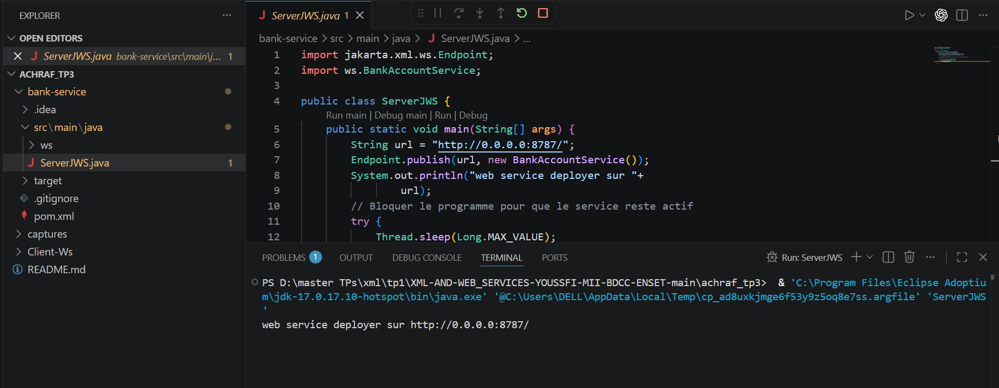
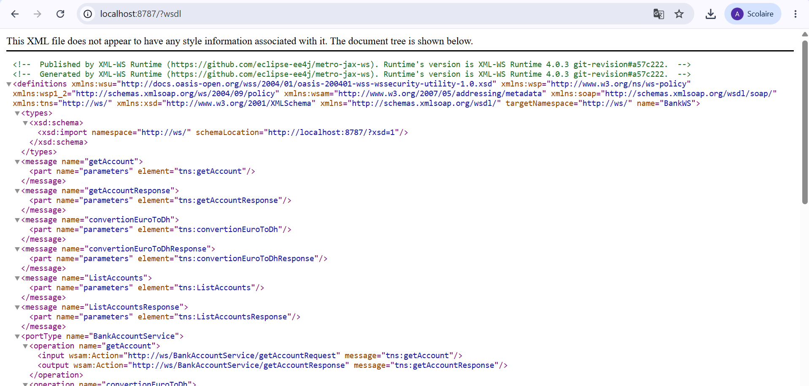
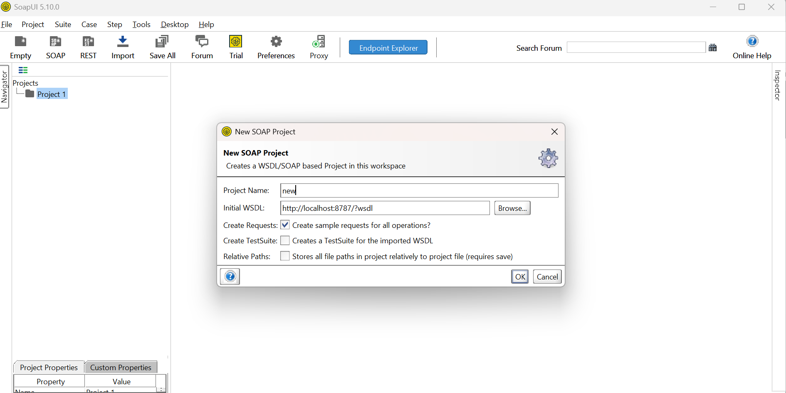
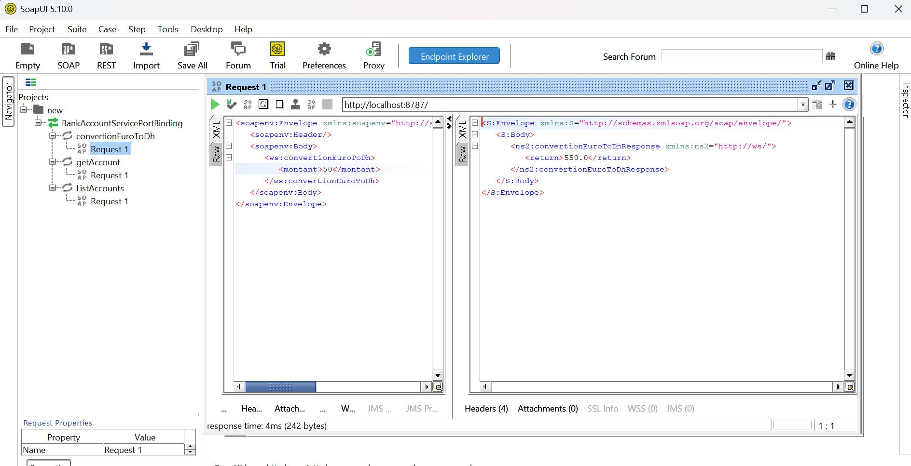
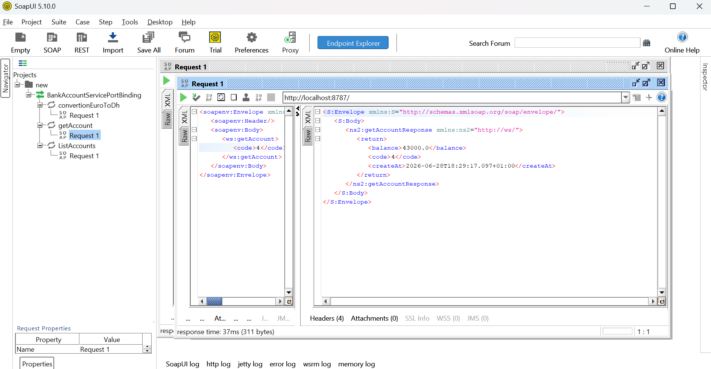
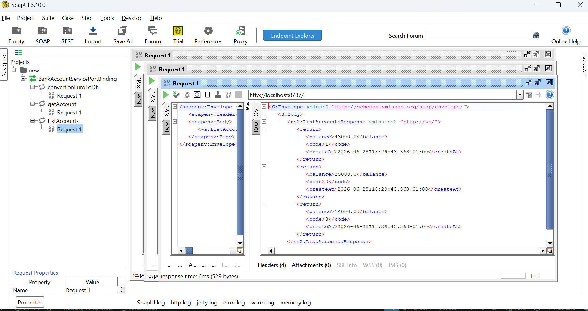
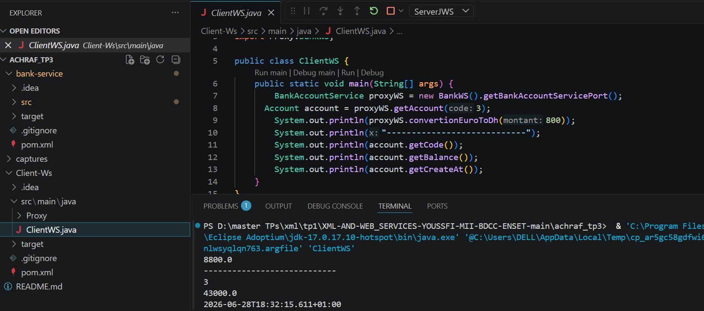

# TP3 - Web Services SOAP (JAX-WS)

## 1. Démarrage du serveur

---

## 2. Consultation du WSDL

---

## 3. Création du projet SOAP dans SoapUI

---

## 4. Test de l'opération `convertionEuroToDh`

---

## 5. Test de l'opération `getAccount`

---

## 6. Test de l'opération `ListAccounts`

---

## 7. Exécution du client Java

